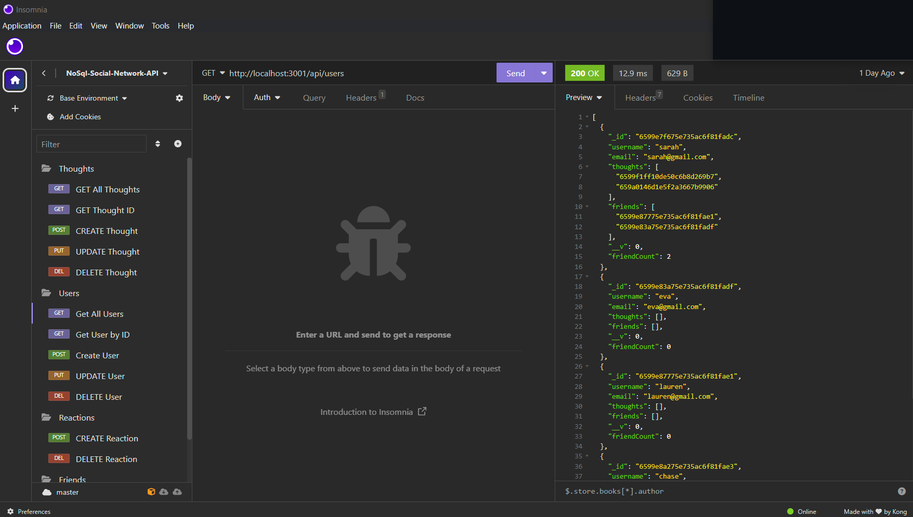
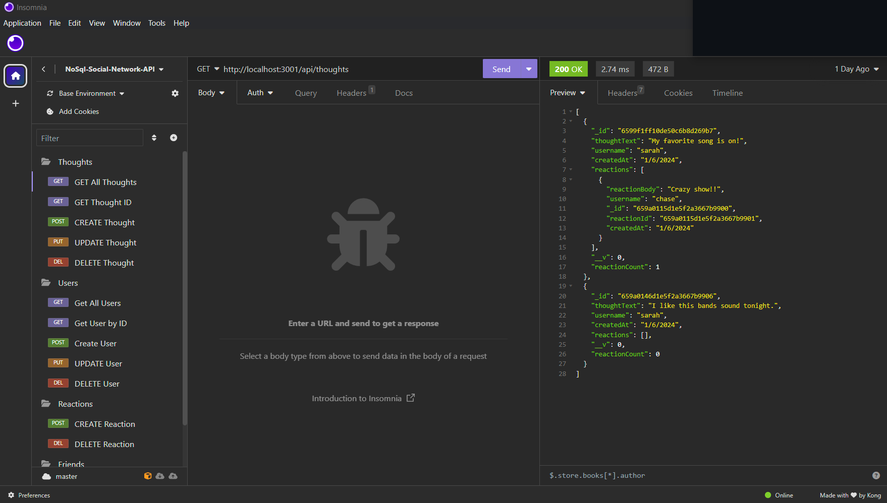

# NoSQL-Social-Network-API


[](https://opensource.org/licenses/MIT)   

## Table of Contents

- [Description](#description)
- [Installation](#installation)
- [Usage](#usage)
- [Screenshot](#screenshot)
- [Video Walkthrough link](#video-walkthrough-link)
- [Credits](#credits)
- [Contribute](#contribute)
- [License](#license)
- [Questions](#questions)

## Description

This application was an assignment from The Ohio State Coding Boot Camp to build an API for a social network web application where users can share their thoughts, react to friends’ thoughts, and create a friend list. I used Express.js for routing, a MongoDB database, and the Mongoose ODM.

## Acceptance Criteria

```md
GIVEN a social network API
WHEN I enter the command to invoke the application
THEN my server is started and the Mongoose models are synced to the MongoDB database
WHEN I open API GET routes in Insomnia for users and thoughts
THEN the data for each of these routes is displayed in a formatted JSON
WHEN I test API POST, PUT, and DELETE routes in Insomnia
THEN I am able to successfully create, update, and delete users and thoughts in my database
WHEN I test API POST and DELETE routes in Insomnia
THEN I am able to successfully create and delete reactions to thoughts and add and remove friends to a user’s friend list
```


## Installation
 - [Visual Studio Code](https://code.visualstudio.com/)
 - [node.js](https://nodejs.org/en)
 - [nodemon](https://www.npmjs.com/package/nodemon)
 - [express](https://www.npmjs.com/package/express)
 - [mongoDB](https://www.mongodb.com/)
 - [mongoDB Compass](https://www.mongodb.com/docs/compass/current/install/)
 - [mongoose](https://mongoosejs.com/)
 - [insomnia](https://insomnia.rest/)

 
       

## Usage

1. Clone the repository to your local computer.
2. Run `npm i` in the command line to make sure all installations are complete.
3. Make sure MongoDB is installed and then run `npm start` to start the server. ( Or to use nodemon type `npm run dev`)
4. Navigate to Insomnia and then use the endpoints to create, read , update, or delete data in JSON format.
5. Optionally, once you have added data, you can open mongoDB Compass and view/edit the database from there as well.


## Screenshot




## Video Walkthrough link

[Click here](https://drive.google.com/file/d/1p-01izDD3gw3zCZ3ZktbYwiDsHMfy7Bu/view)

## Credits

 - This application is an assignment from module 18 from [The Ohio State University Coding Boot Camp](https://eng-bootcamps.osu.edu/).  The Acceptance Criteria above is from the challenge in module 18. 
 - Activity 26 from the course materials was used as a base template for this application.


## Contribute 

If you would like to contribute please use the [Contributor Covenant](https://www.contributor-covenant.org/).


## License

[](https://opensource.org/licenses/MIT)   

***MIT License***

## Questions

 - Github Profile for [rickibobbii](https://github.com/rickibobbii)